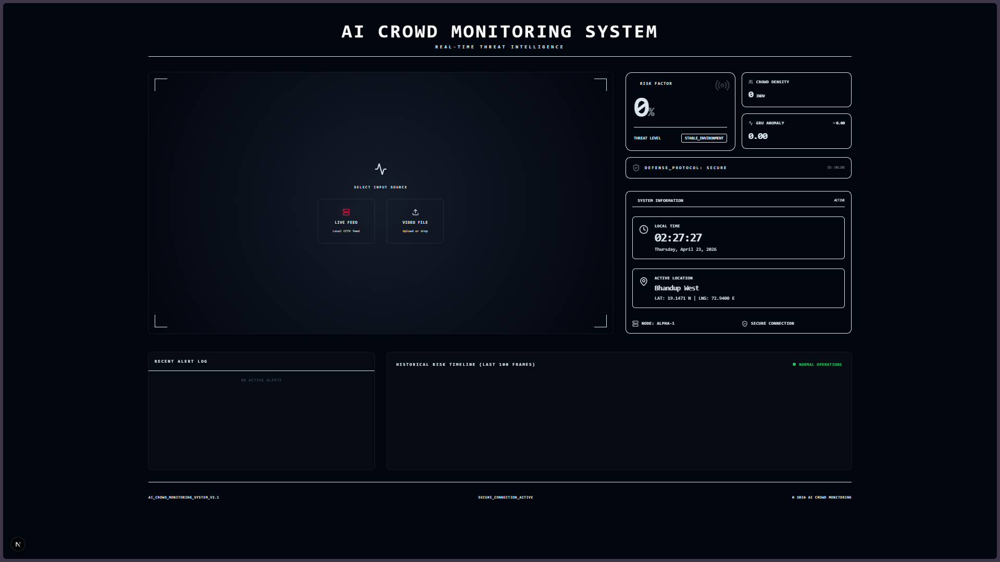
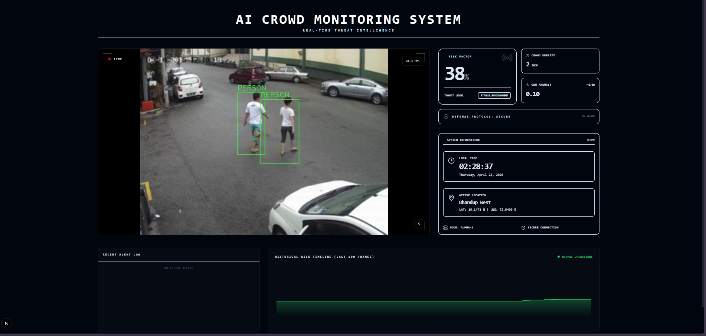

# AI-Based Crowd Behavior and Riot Detection System

**Cognitive Surveillance & Real-Time Threat Intelligence HUD**

---


An AI-Based Crowd Behavior and Riot Detection System — a high-fidelity AI surveillance dashboard designed for mission-critical command centers. It features a modern bento-grid HUD, real-time spatial awareness, and a multi-rate asynchronous pipeline that delivers true real-time performance without UI lag.



## 🚀 Key Features

- **Tactical HUD**: A premium, glassmorphic dashboard built with Next.js and Framer Motion, optimized for expansive 4K situational awareness.
- **Spatial Awareness Radar**: Real-time 2D projection of all tracked individuals, highlighting anomalies and security breaches instantly.
- **Parallel Async Architecture**: A decoupled backend pipeline that processes video, detects people, and extracts behavior features in separate threads to maintain 30+ UI FPS.
- **Advanced Weapon Intelligence**: High-frequency weapon scanning (tuned for Interval 2) with temporal smoothing to eliminate false positives while ensuring instant reaction.
- **Forensic Auditing**: Encrypted alert snapshots with full technical metadata (IDs, scores, and trajectories) for post-incident security reviews.
- **Resource Watchdog**: Intelligent auto-pause system that releases hardware resources when no active viewers are connected.

## 🏗️ System Architecture

The system operates on a **Non-Blocking Multi-Rate Pipeline**:

1.  **Frame Buffer (LIFO)**: Ensures the AI always sees the *latest* possible frame, eliminating the "lag backlog" found in traditional serial systems.
2.  **Vector Tracking**: Propagates bounding boxes across frames using high-speed heuristics, keeping the UI smooth even during AI skip-frames.
3.  **Behavior Desk**: A temporal GRU model that analyzes patterns over time to predict escalation and riot risks before they happen.

## 🛠️ Installation & Setup

### 1. Environment Preparation
```bash
# Clone the repository
git clone https://github.com/[your-repo]/AI-Based-Crowd-Behavior-and-Riot-Detection-System.git
cd AI-Based-Crowd-Behavior-and-Riot-Detection-System

# Create virtual environment
python -m venv venv
source venv/bin/activate  # venv\Scripts\activate on Windows

# Install dependencies
pip install -r requirements.txt
```

### 2. Model Configuration
Ensure the following models are placed in the `models/weights/` directory:
- `yolov8n.pt` (General detection)
- `weapon.pt` (Tactical detection)
- `best_gru_model.pth` (Behavior analytics)
- `risk_model.pkl` (Machine Learning risk fusion)

### 3. Launch the Backend Engine & API
```bash
python run_system.py
```
*The backend API and AI engine will start on `http://localhost:8000`*

### 4. Launch the Frontend Dashboard
Open a new terminal, and run the following:
```bash
cd frontend
npm install
npm run dev
```
*Access the dashboard console at: `http://localhost:3000`*

## 📸 System Screenshots

### Normal Crowd Monitoring


### Anomalous / Riot Behavior Detection


## ⚙️ Configuration
Tweak `config/config.py` for your hardware environment:
- `WEAPON_INTERVAL`: Adjust detection frequency (default: 2).
- `PERSON_CONF`: Sensitivity of tracking (default: 0.55).
- `RIOT_THRESHOLD`: Alert escalation sensitivity (default: 0.60).

---

**Developed for Cognitive Security Systems**
*AI-Based Crowd Behavior and Riot Detection System V2.1 — Encrypted Link Established*
